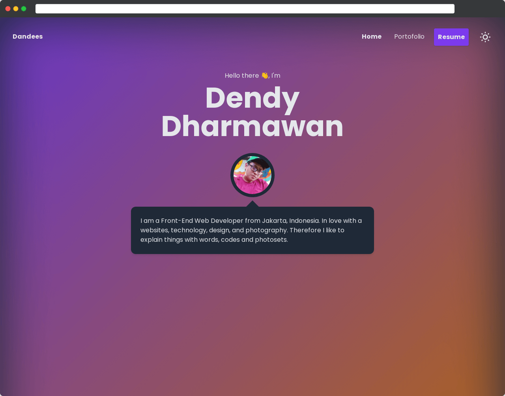

  

<h1 align="center">
  Dendy Dharmawan
</h1>

  <a href="https://dendydharmawan.thedev.id/" target="_blank">dendydharmawan.thedev.id</a>

 
 
 

# My Portofolio v2.0

## Dendy Dharmawan Portofolio v2.0

Sebuah website pribadi sebagai tempat cerita mengenai diri saya dan beberapa hal yang pernah saya kerjakan.

 
 

  

 
 

## Development

1. Install dependencies using `yarn`
2. Start development server using `yarn dev`

For production you can bundle script using `yarn generate`, then you can run it using `yarn start`
